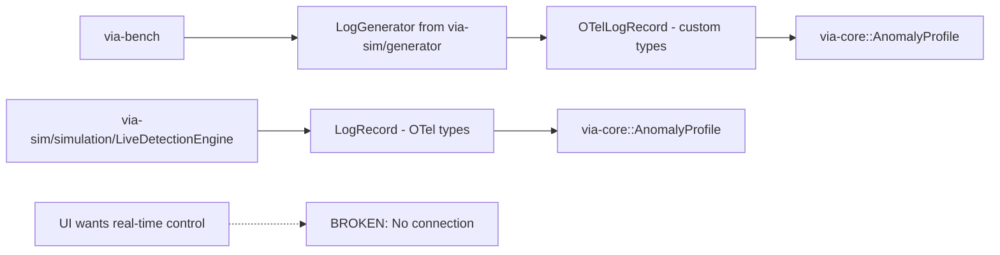
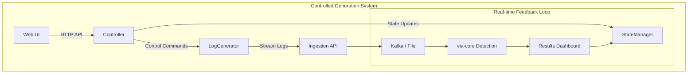
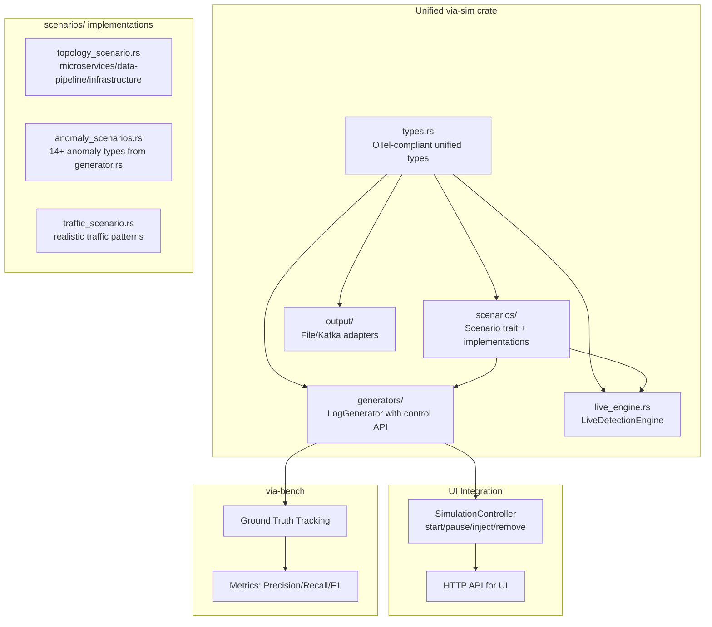
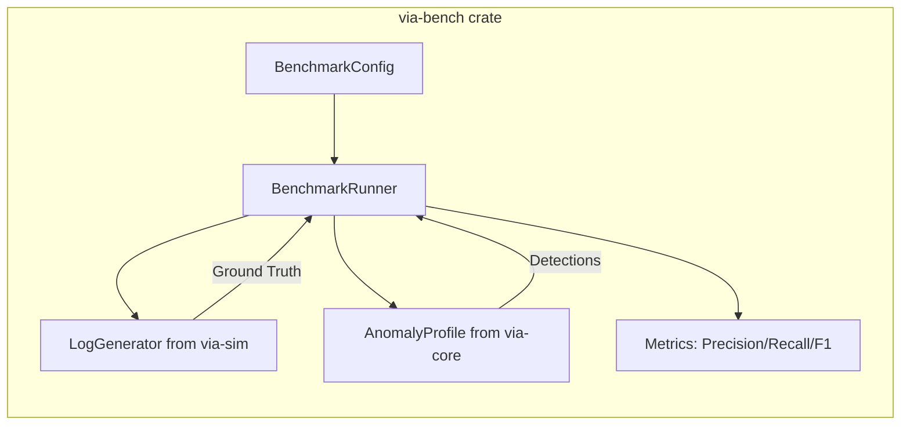

# via-sim Crate Merge Plan

## Problem Statement

The `via-sim` crate has **two completely separate logging systems** with no shared types or integration:

| Component | Purpose | Types Used |
|-----------|---------|------------|
| [`generator.rs`](via-core/crates/via-sim/src/generator.rs) | Comprehensive log generation with topologies and anomalies | Custom `OTelLogRecord`, `Severity`, `AttributeValue` |
| [`simulation/`](via-core/crates/via-sim/src/simulation/) | OTel-compliant simulation with LiveDetectionEngine | `OTelLog`, `LogRecord`, `AnyValue` (snake_case OTel format) |

---

## Key Discovery: Benchmarking Architecture Issues

**The current benchmarking is broken** - here's why:



### Current Benchmarking Flow (via-bench/lib.rs)

1. [`BenchmarkRunner::run()`](via-core/crates/via-bench/src/lib.rs:100) creates `LogGenerator` from `generator.rs`
2. Generates windows of `OTelLogRecord`
3. Processes each log through `AnomalyProfile::process()`
4. **No ground truth tracking** - `is_log_anomalous()` returns `false` (line 219-224)
5. **No real-time control** - generation is pre-configured, not interactive

### What's Missing

| Feature | Current State | Needed State |
|---------|--------------|--------------|
| Ground Truth | Always `false` | Track injected anomalies |
| Real-time Control | Static config | Pause/resume/inject anomalies mid-run |
| Live Visualization | Not integrated | Connect to UI |
| Metrics Correlation | Manual | Automatic anomaly-to-detection mapping |

---

## New Requirement: Controlled Generation for UI

When building the UI for benchmarking, you need to:
1. **Control generation** - Start/pause/stop log generation
2. **Inject anomalies dynamically** - Add anomalies while running
3. **See real-time results** - Detection results as they happen
4. **Track ground truth** - Know which logs were part of injected anomalies



---

## Best of Both Worlds Goal

Combine:
- **generator.rs** capabilities: topologies, service configs, 14+ anomaly types, realistic distributions
- **simulation/** capabilities: OTel-compliant types, Scenario trait, LiveDetectionEngine integration
- **via-bench** capabilities: benchmarking metrics, detector evaluation
- **NEW**: Controlled generation for UI integration

---

## Proposed Unified Architecture



---

## Step-by-Step Refactoring Plan

### Phase 1: Unify Types (Foundation)

**File:** [`via-core/crates/via-sim/src/simulation/types.rs`](via-core/crates/via-sim/src/simulation/types.rs)

Add missing types to make it the single source of truth:

```rust
// Add to types.rs - with Serialize/Deserialize
#[derive(Clone, Debug, Serialize, Deserialize)]
pub enum SeverityLevel {
    Debug,
    Info,
    Warn,
    Error,
    Fatal,
}

impl From<SeverityLevel> for u32 {
    fn from(s: SeverityLevel) -> Self {
        match s {
            SeverityLevel::Debug => 5,
            SeverityLevel::Info => 9,
            SeverityLevel::Warn => 13,
            SeverityLevel::Error => 17,
            SeverityLevel::Fatal => 21,
        }
    }
}

#[derive(Clone, Debug, Serialize, Deserialize)]
pub struct ServiceConfig {
    pub name: String,
    pub base_rps: f64,
    pub latency_mean_ms: f64,
    pub latency_std_ms: f64,
    pub error_rate: f64,
    pub dependency_services: Vec<String>,
}

#[derive(Clone, Debug, Serialize, Deserialize)]
pub struct AnomalyConfig {
    pub id: String,  // Unique identifier for control
    pub anomaly_type: AnomalyType,
    pub start_time_sec: u64,
    pub duration_sec: u64,
    pub severity: f64,  // 0.0 to 1.0
    pub target_services: Vec<String>,
    pub is_active: bool,  // For runtime control
}

#[derive(Clone, Debug, Serialize, Deserialize)]
pub enum AnomalyType {
    // Volume anomalies
    TrafficSpike { multiplier: f64 },
    DDoSAttack { source_ips: usize },

    // Performance anomalies
    MemoryLeak { leak_rate_mb_per_sec: f64 },
    CpuSaturation { intensity: f64 },
    SlowQueries { latency_multiplier: f64 },

    // Security anomalies
    CredentialStuffing { attempts_per_sec: f64 },
    SqlInjection { probe_rate: f64 },
    PortScan { scan_speed: f64 },
    BruteForce { target_users: Vec<String> },

    // Cardinality anomalies
    NewEntityFlood { unique_entities_per_sec: f64 },
    IpRotation { unique_ips_per_sec: f64 },

    // Pattern anomalies
    BusinessHoursViolation { activity_multiplier: f64 },
    GeoImpossibility { travel_speed_kmh: f64 },

    // Distributed anomalies
    CascadeFailure { failure_rate: f64 },
    ThunderingHerd { burst_size: usize },
}

/// Ground truth tracking for benchmarking
#[derive(Clone, Debug, Serialize, Deserialize)]
pub struct GroundTruth {
    pub anomaly_id: String,
    pub start_time_ns: u64,
    pub end_time_ns: u64,
    pub anomaly_type: AnomalyType,
    pub target_services: Vec<String>,
}
```

### Phase 2: Refactor Scenario Trait for Controlled Generation

**File:** [`via-core/crates/via-sim/src/simulation/scenarios/mod.rs`](via-core/crates/via-sim/src/simulation/scenarios/mod.rs)

```rust
pub trait Scenario: Send {
    fn name(&self) -> &str;
    fn tick(&mut self, current_time_ns: u64, delta_ns: u64) -> Vec<LogRecord>;
    fn is_active(&self) -> bool;  // NEW: check if scenario should generate
    fn inject_anomaly(&mut self, config: &AnomalyConfig);  // NEW: runtime injection
    fn remove_anomaly(&mut self, id: &str);  // NEW: runtime removal
    fn get_ground_truth(&self) -> Vec<GroundTruth>;  // NEW: for benchmarking
}

/// Top-level controlled simulation
pub struct ControlledSimulation {
    scenarios: Vec<Box<dyn Scenario>>,
    current_time_ns: u64,
    active_anomalies: HashMap<String, AnomalyConfig>,  // NEW: controlled anomalies
    ground_truth: Vec<GroundTruth>,  // NEW: track injected anomalies
    is_paused: bool,  // NEW: pause/resume
}

impl ControlledSimulation {
    pub fn new() -> Self;
    
    // NEW: Control API
    pub fn start(&mut self);
    pub fn pause(&mut self);
    pub fn resume(&mut self);
    pub fn inject_anomaly(&mut self, config: AnomalyConfig) -> String;  // Returns ID
    pub fn remove_anomaly(&mut self, id: &str);
    pub fn set_rate_multiplier(&mut self, multiplier: f64);
    pub fn get_state(&self) -> SimulationState;
    
    // Generation
    pub fn tick(&mut self, delta_ns: u64) -> (Vec<LogRecord>, Vec<GroundTruth>);
}

#[derive(Clone, Debug)]
pub struct SimulationState {
    pub is_running: bool,
    pub is_paused: bool,
    pub current_time_ns: u64,
    pub events_generated: u64,
    pub active_anomaly_ids: Vec<String>,
    pub current_eps: f64,
}
```

### Phase 3: Create Unified LogGenerator with Control API

**New file:** [`via-core/crates/via-sim/src/generators/mod.rs`](via-core/crates/via-sim/src/generators/mod.rs)

```rust
use crate::simulation::types::{LogRecord, ServiceConfig, AnomalyConfig, SimulationState, GroundTruth};
use crate::simulation::ControlledSimulation;

pub struct LogGenerator {
    services: Vec<ServiceConfig>,
    simulation: ControlledSimulation,
    ground_truth: Vec<GroundTruth>,
}

impl LogGenerator {
    pub fn new(services: Vec<ServiceConfig>) -> Self;
    
    // Control API (for UI)
    pub fn start(&mut self);
    pub fn pause(&mut self);
    pub fn resume(&mut self);
    pub fn inject_anomaly(&mut self, config: AnomalyConfig) -> String;
    pub fn remove_anomaly(&mut self, id: &str);
    pub fn set_rate(&mut self, eps: u64);
    
    // Generation
    pub fn generate_window(&mut self, duration_sec: u64) -> Vec<LogRecord>;
    pub fn generate_tick(&mut self, delta_ns: u64) -> Vec<LogRecord>;
    
    // For benchmarking
    pub fn get_ground_truth(&self) -> Vec<GroundTruth>;
    pub fn get_state(&self) -> SimulationState;
}

/// Controller for UI integration
pub struct SimulationController {
    generator: LogGenerator,
    state: Arc<RwLock<SimulationState>>,
    output: Box<dyn LogOutput>,
}

impl SimulationController {
    pub fn new(generator: LogGenerator, output: &str) -> Self;
    
    // UI-facing async API
    pub async fn start(&mut self);
    pub async fn pause(&mut self);
    pub async fn resume(&mut self);
    pub async fn inject_anomaly(&mut self, config: AnomalyConfig) -> String;
    pub async fn remove_anomaly(&mut self, id: &str);
    pub async fn set_rate(&mut self, eps: u64);
    pub async fn get_state(&self) -> SimulationState;
    pub fn subscribe(&self) -> StateSubscription;
}
```

### Phase 4: Add Output Adapters

**New files:**
- [`via-core/crates/via-sim/src/output/mod.rs`](via-core/crates/via-sim/src/output/mod.rs)
- [`via-core/crates/via-sim/src/output/file.rs`](via-core/crates/via-sim/src/output/file.rs)
- [`via-core/crates/via-sim/src/output/kafka.rs`](via-core/crates/via-sim/src/output/kafka.rs)

```rust
pub trait LogOutput: Send {
    fn write(&mut self, logs: &[LogRecord]) -> std::io::Result<()>;
    fn flush(&mut self) -> std::io::Result<()>;
}

pub struct FileOutput {
    path: PathBuf,
    file: Option<File>,
}

pub struct KafkaOutput {
    producer: /* Kafka producer */,
    topic: String,
}

pub struct ControlledOutput<O: LogOutput> {
    inner: O,
    state: Arc<RwLock<SimulationState>>,
}
```

### Phase 5: Update via-bench for Proper Benchmarking

**File:** [`via-core/crates/via-bench/src/lib.rs`](via-core/crates/via-bench/src/lib.rs)

```rust
impl BenchmarkRunner {
    pub fn run(&mut self, config: BenchmarkConfig) -> BenchmarkResults {
        // ... existing setup ...
        
        let mut generator = LogGenerator::new(/* services */);
        
        // Inject anomalies with IDs
        for anomaly in &config.anomalies {
            let id = generator.inject_anomaly(anomaly.clone());
        }
        
        let windows = (config.duration_minutes * 60) / config.window_size_sec;

        for window in 0..windows {
            let logs = generator.generate_window(config.window_size_sec);
            
            // Track ground truth for each log
            for log in &logs {
                let is_actual_anomaly = self.check_ground_truth(log, &generator.get_ground_truth());
                self.ground_truth.push((log.timestamp, is_actual_anomaly));
                
                // Process through detection
                let result = self.profile.process(timestamp, &entity_id, value);
                self.track_detection(result, is_actual_anomaly);
            }
        }
        
        // Calculate proper metrics
        self.calculate_precision_recall_f1();
        self.results
    }
    
    fn check_ground_truth(&self, log: &LogRecord, ground_truth: &[GroundTruth]) -> bool {
        // Check if this log falls within any injected anomaly's time window
        ground_truth.iter().any(|gt| {
            gt.start_time_ns <= log.time_unix_nano &&
            log.time_unix_nano <= gt.end_time_ns &&
            gt.target_services.iter().any(|s| {
                log.attributes.iter().any(|a| a.key == "service.name" && a.value.string_value == *s)
            })
        })
    }
}
```

### Phase 6: Update main.rs for CLI

**File:** [`via-core/crates/via-sim/src/main.rs`](via-core/crates/via-sim/src/main.rs)

```rust
use via_sim::generators::LogGenerator;
use via_sim::simulation::types::{topologies, AnomalyConfig, AnomalyType};
use via_sim::output::{FileOutput, KafkaOutput};

// Add new command for controlled mode
#[derive(Subcommand)]
enum Commands {
    // ... existing commands ...
    
    /// Interactive mode with real-time control
    Controlled {
        /// Web UI port
        #[arg(short, long, default_value = "8080")]
        port: u16,
        
        /// Output target (file or kafka://broker/topic)
        #[arg(short, long, default_value = "stdout")]
        output: String,
    },
}

fn run_controlled(port: u16, output: &str) {
    let mut generator = LogGenerator::new(topologies::microservices());
    
    // Start the controller (could spawn HTTP server for UI)
    let controller = SimulationController::new(generator, output);
    controller.start();
}
```

### Phase 7: Clean Up

1. Delete `generator.rs` (functionality moved to `generators/mod.rs`)
2. Remove duplicate types from simulation/types.rs
3. Update `lib.rs` exports
4. Ensure all scenarios use unified types

---

## Updated File Structure After Merge

```
via-core/crates/via-sim/src/
├── lib.rs                    # Main exports
├── main.rs                   # CLI with controlled mode
├── stress.rs                 # Separate HTTP load tester (keep as-is)
└── simulation/
    ├── mod.rs                # SimulationEngine, LiveDetectionEngine, ControlledSimulation
    ├── types.rs              # UNIFIED TYPES (source of truth)
    ├── live_engine.rs        # LiveDetectionEngine
    └── scenarios/
        ├── mod.rs            # Scenario trait (enhanced)
        ├── traffic.rs        # NormalTraffic (enhanced)
        ├── performance.rs    # MemoryLeak, CpuSaturation (enhanced)
        ├── security.rs       # CredentialStuffing, etc. (enhanced)
        ├── topology.rs       # NEW: microservices/data-pipeline/infrastructure
        └── anomaly.rs        # NEW: consolidated anomaly scenarios
├── generators/
    ├── mod.rs                # LogGenerator, SimulationController
    └── topologies.rs         # Predefined service configs
└── output/
    ├── mod.rs                # LogOutput trait
    ├── file.rs               # FileOutput
    └── kafka.rs              # KafkaOutput
```

---

## Key Decisions

### Why Keep Both Paths?

| Feature | Reason |
|---------|--------|
| **Scenario trait** | Enables LiveDetectionEngine integration and runtime scenario switching |
| **LogGenerator** | Provides simple batch generation for benchmarking/testing |
| **ControlledSimulation** | NEW - enables UI control and ground truth tracking |
| **Unified types** | Single source of truth, no conversion needed |

### Naming Convention

Use OTel-compliant **snake_case** for all public types (from `simulation/types.rs`):
- `trace_id` not `traceId`
- `severity_number` not `severityNumber`
- `time_unix_nano` not `timeUnixNano`

### Backward Compatibility

This is a **breaking change**. Update version to `0.2.0` and:
- Update all imports in `main.rs`
- Update `lib.rs` exports
- Update any external consumers

---

## Files to Modify/Create

| File | Action | Description |
|------|--------|-------------|
| `simulation/types.rs` | MODIFY | Add `ServiceConfig`, `AnomalyConfig`, `AnomalyType`, `SeverityLevel`, `GroundTruth` |
| `simulation/scenarios/mod.rs` | MODIFY | Add `is_active()`, `inject_anomaly()`, `remove_anomaly()`, `get_ground_truth()` to Scenario trait; Add `ControlledSimulation` |
| `simulation/scenarios/topology.rs` | CREATE | Topology scenarios (microservices, etc.) |
| `simulation/scenarios/anomaly.rs` | CREATE | Consolidated anomaly scenarios |
| `generators/mod.rs` | CREATE | `LogGenerator`, `SimulationController` |
| `generators/topologies.rs` | CREATE | Predefined topologies |
| `output/mod.rs` | CREATE | `LogOutput` trait |
| `output/file.rs` | CREATE | `FileOutput` |
| `output/kafka.rs` | CREATE | `KafkaOutput` |
| `main.rs` | MODIFY | Add `Controlled` command, use unified system |
| `lib.rs` | MODIFY | Update exports |
| `generator.rs` | DELETE | Remove after migration |
| `via-bench/lib.rs` | MODIFY | Fix ground truth tracking, proper metrics |

---

## Testing Strategy

1. **Unit tests**: Each scenario generates valid OTel logs
2. **Integration tests**: LogGenerator produces same output as original
3. **Control tests**: Start/pause/inject/remove work correctly
4. **Ground truth tests**: Injected anomalies are correctly tracked
5. **Performance tests**: Ensure no regression in log generation throughput
6. **Output tests**: File and Kafka outputs produce correct format

---

## UI Integration Points

The `SimulationController` should expose:

```rust
// HTTP API endpoints for UI
POST /start     - Start generation
POST /pause     - Pause generation
POST /resume    - Resume generation
POST /anomaly   - Inject anomaly
DELETE /anomaly/{id} - Remove anomaly
PUT /rate       - Set events per second
GET /state      - Get current state
GET /events     - Stream events (SSE or WebSocket)
```

This enables:
- Real-time dashboard showing generation rate
- Buttons to inject anomalies on-the-fly
- Live detection results from via-core
- Ground truth visualization for benchmarking

---

## via-bench Upgrade Plan

**Keep as separate crate** - benchmarking is a distinct concern from simulation. via-bench depends on both via-sim and via-core.

### Current Issues in via-bench

| Issue | Location | Impact |
|-------|----------|--------|
| Broken ground truth | [`is_log_anomalous()`](via-core/crates/via-bench/src/lib.rs:219) always returns `false` | No precision/recall metrics |
| Placeholder metrics | [`calculate_detector_metrics()`](via-core/crates/via-bench/src/lib.rs:248) creates zeroed metrics | No real evaluation |
| Uses old types | Imports `via_sim::generator::*` | Will break after via-sim refactor |
| No per-detector tracking | Can't measure individual detector performance | Limited insights |

### Architecture After Upgrade



### Phase B1: Update to Unified Types

**File:** [`via-core/crates/via-bench/src/lib.rs`](via-core/crates/via-bench/src/lib.rs)

```rust
// Before (uses old generator types)
use via_sim::generator::{topologies, AnomalyConfig, AnomalyType, LogGenerator, OTelLogRecord};

// After (uses unified types)
use via_sim::generators::LogGenerator;
use via_sim::simulation::types::{
    topologies, AnomalyConfig, AnomalyType, ServiceConfig, GroundTruth, LogRecord
};
```

Update `BenchmarkConfig`:
```rust
#[derive(Serialize, Deserialize, Clone, Debug)]
pub struct BenchmarkConfig {
    pub name: String,
    pub topology: Topology,
    pub duration_minutes: u64,
    pub window_size_sec: u64,
    pub anomalies: Vec<AnomalyConfig>,  // Will use unified AnomalyConfig
}

// Update Topology to use unified ServiceConfig
#[derive(Clone, Serialize, Deserialize, Debug)]
pub enum Topology {
    Microservices(Vec<ServiceConfig>),
    DataPipeline(Vec<ServiceConfig>),
    Infrastructure(Vec<ServiceConfig>),
}

impl Topology {
    pub fn services(&self) -> Vec<ServiceConfig> {
        match self {
            Topology::Microservices(s) => s.clone(),
            Topology::DataPipeline(s) => s.clone(),
            Topology::Infrastructure(s) => s.clone(),
        }
    }
}
```

### Phase B2: Fix Ground Truth Tracking

**Critical fix** - implement proper ground truth:

```rust
pub struct BenchmarkRunner {
    profile: AnomalyProfile,
    results: BenchmarkResults,
    latencies: Vec<u64>,
    // NEW: Track ground truth properly
    ground_truth: HashMap<u64, Vec<GroundTruth>>,  // timestamp -> anomalies
    anomaly_configs: HashMap<String, AnomalyConfig>,  // id -> config
    // NEW: Track detections per detector
    detector_results: HashMap<String, Vec<DetectionEvent>>,
}

struct DetectionEvent {
    timestamp: u64,
    entity_id: String,
    detector_name: String,
    score: f64,
    is_anomaly: bool,
}

impl BenchmarkRunner {
    pub fn run(&mut self, config: BenchmarkConfig) -> BenchmarkResults {
        // ... setup ...
        
        // NEW: Store anomaly configs for ground truth checking
        for anomaly in &config.anomalies {
            self.anomaly_configs.insert(anomaly.id.clone(), anomaly.clone());
        }
        
        let mut generator = LogGenerator::new(config.topology.services());
        
        // Inject anomalies and capture ground truth
        for anomaly in &config.anomalies {
            let id = generator.inject_anomaly(anomaly.clone());
            self.results.total_anomalies_injected += 1;
            
            // Track ground truth window
            let start_ns = anomaly.start_time_sec as u64 * 1_000_000_000;
            let end_ns = start_ns + (anomaly.duration_sec as u64 * 1_000_000_000);
            
            self.ground_truth.insert(id, vec![
                GroundTruth {
                    anomaly_id: id.clone(),
                    start_time_ns: start_ns,
                    end_time_ns: end_ns,
                    anomaly_type: anomaly.anomaly_type.clone(),
                    target_services: anomaly.target_services.clone(),
                }
            ]);
        }
        
        // ... generate and process logs ...
        
        // NEW: Calculate proper metrics
        self.calculate_detector_metrics();
        
        self.results.clone()
    }
    
    // NEW: Implement proper ground truth checking
    fn check_ground_truth(&self, log: &LogRecord) -> Vec<String> {
        let timestamp = log.time_unix_nano.parse::<u64>().unwrap_or(0);
        let service = log.attributes.iter()
            .find(|a| a.key == "service.name")
            .map(|a| a.value.string_value.clone());
        
        let mut matching_anomalies = Vec::new();
        
        for (id, gts) in &self.ground_truth {
            for gt in gts {
                if timestamp >= gt.start_time_ns && 
                   timestamp <= gt.end_time_ns &&
                   service.as_ref().map(|s| gt.target_services.contains(s)).unwrap_or(false) {
                    matching_anomalies.push(id.clone());
                }
            }
        }
        
        matching_anomalies
    }
}
```

### Phase B3: Implement Real Detector Metrics

**Replace placeholder with actual calculation:**

```rust
fn calculate_detector_metrics(&mut self) {
    // Get actual detector names from via-core
    let detectors = self.profile.get_detector_names();
    
    for detector_name in detectors {
        let mut tp = 0;
        let mut fp = 0;
        let mut tn = 0;
        let mut fn_ = 0;
        let mut scores = Vec::new();
        
        for event in self.detector_results.get(&detector_name).unwrap_or(&vec![]) {
            let is_actual_anomaly = !self.check_ground_truth_by_timestamp(event.timestamp).is_empty();
            
            scores.push(event.score);
            
            match (event.is_anomaly, is_actual_anomaly) {
                (true, true) => tp += 1,
                (true, false) => fp += 1,
                (false, true) => fn_ += 1,
                (false, false) => tn += 1,
            }
        }
        
        let precision = if tp + fp > 0 { tp as f64 / (tp + fp) as f64 } else { 0.0 };
        let recall = if tp + fn_ > 0 { tp as f64 / (tp + fn_) as f64 } else { 0.0 };
        let f1 = if precision + recall > 0 { 2.0 * precision * recall / (precision + recall) } else { 0.0 };
        let avg_score = scores.iter().sum::<f64>() / scores.len() as f64;
        
        self.results.detector_metrics.insert(
            detector_name,
            DetectorMetrics {
                name: detector_name,
                true_positives: tp,
                false_positives: fp,
                true_negatives: tn,
                false_negatives: fn_,
                precision,
                recall,
                f1_score: f1,
                avg_score,
                trigger_count: tp + fp,
            }
        );
    }
}
```

### Phase B4: Update Scenarios Module

**File:** [`via-core/crates/via-bench/src/lib.rs`](via-core/crates/via-bench/src/lib.rs) - `scenarios` module

Update to use unified `AnomalyConfig` with IDs:

```rust
pub fn mixed_workload() -> BenchmarkConfig {
    BenchmarkConfig {
        name: "Mixed Workload - All Anomaly Types".to_string(),
        topology: Topology::Microservices(topologies::microservices()),
        duration_minutes: 5,
        window_size_sec: 10,
        anomalies: vec![
            AnomalyConfig {
                id: "credential-stuffing-1".to_string(),  // NEW: unique ID
                anomaly_type: AnomalyType::CredentialStuffing {
                    attempts_per_sec: 100.0,
                },
                start_time_sec: 60,
                duration_sec: 60,
                severity: 0.8,
                target_services: vec!["auth-service".to_string()],
                is_active: true,
            },
            // ... other anomalies
        ],
    }
}
```

### Phase B5: Add Real-time Benchmark Mode

Add new command for interactive benchmarking:

```rust
// In main.rs
#[derive(Subcommand)]
enum Commands {
    // ... existing commands ...
    
    /// Interactive benchmark with real-time anomaly injection
    Interactive {
        /// Duration in minutes
        #[arg(short, long, default_value = "10")]
        duration: u64,
        
        /// Web UI port
        #[arg(short, long, default_value = "8081")]
        port: u16,
    },
}

fn run_interactive_benchmark(duration: u64, port: u16) {
    // Start HTTP server for:
    // - Inject anomalies during run
    // - View real-time metrics
    // - Export results
    println!("Interactive benchmark mode on port {}", port);
}
```

### via-bench Files to Modify

| File | Action | Description |
|------|--------|-------------|
| `src/lib.rs` | MODIFY | Update imports, fix ground truth, implement real metrics |
| `src/main.rs` | MODIFY | Add `Interactive` command |
| `Cargo.toml` | CHECK | May need tokio-tracing for async support |

### via-bench Dependencies

```toml
# via-bench/Cargo.toml (additions)
via-sim = { path = "../via-sim" }  # Already exists
via-core = { workspace = true }    # Already exists

# Add for interactive mode
tokio = { workspace = true, features = ["full"] }
axum = "0.7"  # For HTTP API
serde_json = { workspace = true }
```

### Key Metrics After Upgrade

| Metric | Description | Calculation |
|--------|-------------|-------------|
| Precision | % of detected anomalies that are real | TP / (TP + FP) |
| Recall | % of real anomalies detected | TP / (TP + FN) |
| F1-Score | Harmonic mean of precision/recall | 2 * P * R / (P + R) |
| Detection Latency | Time from anomaly start to detection | timestamp(detection) - timestamp(anomaly_start) |
| False Positive Rate | % of normal logs marked anomalous | FP / (FP + TN) |
| Per-Detector | Individual detector performance | Separate metrics per algorithm |

---

## Execution Order

**Recommended sequence:**

1. **Phase 1-2 (via-sim)**: Unify types, refactor Scenario trait
2. **Phase B1 (via-bench)**: Update to use unified types (blocking change)
3. **Phase 3 (via-sim)**: Create unified LogGenerator
4. **Phase B2 (via-bench)**: Fix ground truth tracking
5. **Phase B3 (via-bench)**: Implement real detector metrics
6. **Phase 4-7 (via-sim)**: Output adapters, cleanup
7. **Phase B4-B5 (via-bench)**: Update scenarios, add interactive mode
